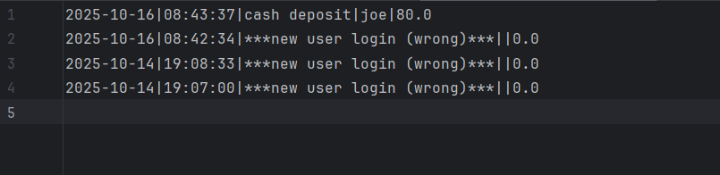

# Year Up United / Pluralsight - Java Capstones (Ravi's Solutions)
## Course Taught By: Maaike Van Putten

### 🛠️ Tools Used

| Active/Inactive | Active Dates |
| --- | --- |
|  | 10/10/2025 - XX/XX/XXXX|

### 📝 Description
Contains a collection of my capstone projects.  
The PDF containing most of the workshop writeups from each week cannot be uploaded due to Pluralsight ownership rights.  
But below you will find brief descriptions of each of the projects, which should give a better idea of their intended function and requirements.  
The Javadoc-style class comments I've made for each of the java files developed for each capstone were designed to be descriptive enough to give the reader a good idea of their intended function and requirements as well.

#### 🕒 Commits History Here 
[Click Here](https://github.com/gitraspigner/capstones/commits/master)  

### 💭 Capstone(s) Detailed:  
#### Capstone 1
- **Capstone Title:** Accounting Ledger (Command Line Application)
  - **Description:** Simulates/is an Accounting Ledger application (ran from a command line interface). The user navigates a series of menus to accomplish different basic functions of the ledger which are primarily either creating new transactions (either adding a deposit or making a payment) or displaying a report/list of transactions (deposits, payments, or transactions from a range of time). This ledger manages (stores & manipulates) transactions according to the current user running the application's input from the command line and are all written to a file (which, for this program is called "transactions.csv"). Transactions are of 2 categories: deposits (positive dollar amounts) and payments (negative dollar amounts). A transaction contains the following information: the date and time of its processing, a description of the type of deposit or (for payments) the item purchased, the name of the depositor or vendor, and the dollar amount deposited or paid.
  - **Application Screens:** -In Progress-
    - Welcome/Greeting, Main Menu Screen, Make Deposit & Make Payment Screens:
    
    - Ledger Menu Screen, All Transactions, All Deposits, and All Payments Screens:
    
    - Reports Menu Screen, Vendor Search & Custom Search Screens:
    
    - Multiple User Sessions Logged (Transactions from previous sessions are accessible):
    
    - Different Files Created For Each User (usernames can be any kind of name (First&Last, First, Last, etc...) an Employee ID, or an Email):
    
    - Malformed File Data
    
    - Malformed Data Warnings
    
    - Malformed Data Removed By Application (screenshot of transactions file after executing application)
    

      
  - **Interesting Code Snippet:** -In Progress-
    - **Snippet:** -In Progress-
    - **Why it's interesting:** -In Progress-
  - **Additional Thoughts:** -In Progress-
---
#### Capstone 2
- **Capstone Title:** -In Progress-
  - **Description:** -In Progress-
  - **Application Screens:** -In Progress-
  - **Interesting Code Snippet:** -In Progress-
    - **Snippet:** -In Progress-
    - **Why it's interesting:** -In Progress-
  - **Additional Thoughts:** -In Progress-
---
#### Capstone 3
 - **Capstone Title:** -In Progress-
 - **Description:** -In Progress-
 - **Application Screens:** -In Progress-
 

  - **Interesting Code Snippet:** -In Progress-
    - **Snippet:** -In Progress-
    - **Why it's interesting:** -In Progress-
  - **Additional Thoughts:** -In Progress-

#### 🔖 Citation
I wrote this README.md, but I did indeed use ChatGPT to give my initial framework and to learn markdown formatting. Therefore here is an APA Style Citation for it:   
OpenAI. (2025). ChatGPT (Oct 1 version) [Large language model]. https://chatgpt.com/  

*I have to give credit where it's due, right?*  

**Last Edited: 10/13/2025**
